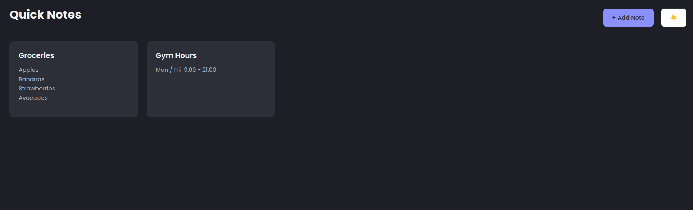

# 📝 Quick Notes

A simple notes app built with **vanilla JavaScript**, **HTML**, and **CSS**.  
Quick Notes lets you create, edit, and delete notes right in your browser — with **localStorage** persistence so your notes survive page reloads.  

---

## ✨ Features
- 🌓 Dark/Light mode toggle  
- ➕ Add new notes with title & content  
- ✏️ Edit existing notes  
- ❌ Delete notes instantly  
- 💾 Notes saved in **localStorage**  
- 📭 Empty state shown when no notes exist  
- 🎨 Clean and responsive UI  

---

## 🛠️ Tech Stack
- HTML5  
- CSS3  
- JavaScript (ES6)  
- LocalStorage API  

---

## 🚀 Getting Started

1. Clone or download this repo  
   ```bash
   git clone https://github.com/your-username/quick-notes.git
2. Open index.html in your browser
3. Start taking notes!

---

## 📸 Preview


---

Made with ❤️ using plain JavaScript.